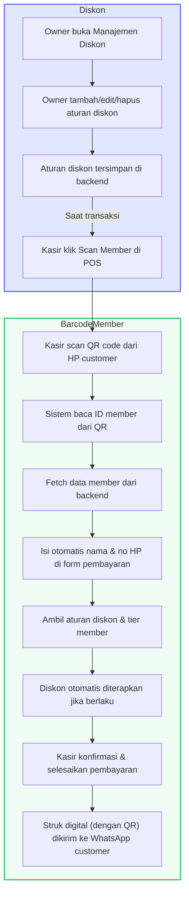

# Alur Sistem Diskon & Barcode Member

## Penjelasan Singkat
- **Owner** mengatur diskon di backend (tambah/edit/hapus aturan diskon).
- **Kasir** scan barcode member saat pembayaran di POS.
- Sistem otomatis fetch data member, terapkan diskon/tier, dan isi data pelanggan.
- Struk digital dengan QR code dikirim ke WhatsApp customer.

## Flowchart Alur Diskon & Barcode Member

---

**File ini dapat di-preview langsung di VSCode, GitHub, atau tool markdown lain yang support Mermaid.** 